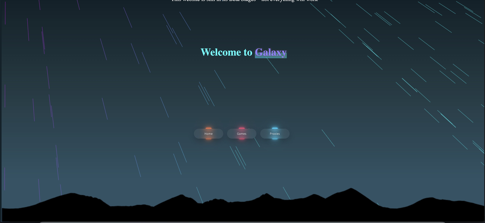

# Galaxy 
## What Is Galaxy?
###### Galaxy is a website built to bypass school firewalls by providing methods and tools for students to access blocked websites and online content that may be restricted by school networks.

## Features

- A Library of Games
- Countless Proxy Links
- Multiple Links
- 

## A Look Inside

